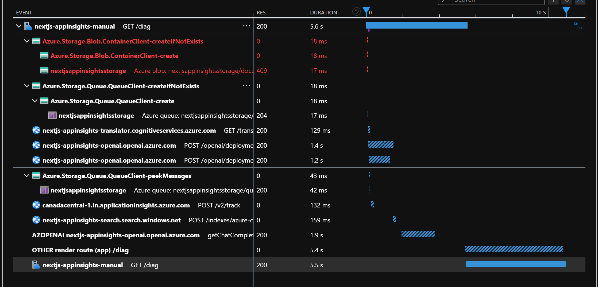

This is a [Next.js](https://nextjs.org/) project bootstrapped with [`create-next-app`](https://github.com/vercel/next.js/tree/canary/packages/create-next-app).

## Getting Started

First, run the development server:

```bash
npm run dev
# or
yarn dev
# or
pnpm dev
# or
bun dev
```

Open [http://localhost:3000](http://localhost:3000) with your browser to see the result.

## Application Insights

There are two branches within this repository - one that tries to use NextJS instrumentation to initialize Application Insights, and one that uses the standard JavaScript SDK into the server.js file.

- [NextJS Instrumentation](https://github.com/jorupp/nextjs-appinsights/tree/feature/appinsights-instrumentation) - does not work (build error message in `README.md`)
- [JavaScript SDK](https://github.com/jorupp/nextjs-appinsights/tree/feature/appinsights-manual) - works

Tracked dependencies for the manual approach:


Calls this page makes and whether they were tracked

- [x] main request
- [x] create blob container
- [x] create queue
- [ ] create table
- [ ] fetch items from storage table
- [x] peek into storage queue
- [ ] fetch document list from storage blob
- [x] OpenAI embeddings
- [ ] OpenAI chat completion
- [x] Search cognitive search index
- [ ] Form analyzer - analyze a document
- [x] Document translation supported formats
